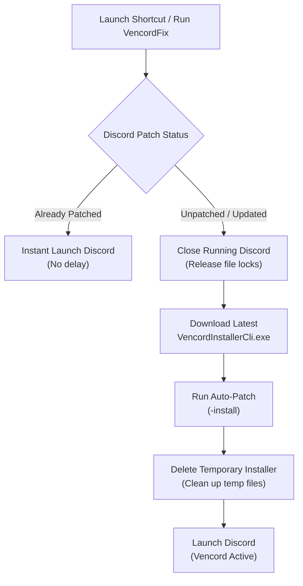

<div align="center">

# VencordFix (Windows)

**Automated Discord Patcher, Updater, and Launcher for Vencord on Windows**  
*Automatically detects updates, patches Discord silently, and cleans up temporary files.*

[](https://github.com/eclipse999/VencordFix)
[](LICENSE)
[](https://discord.com)
[](https://vencord.dev)

**English** | [繁體中文](docs/README.zh-TW.md)

</div>

---

## Table of Contents

- [Overview](#overview)
- [Features](#features)
- [How It Works](#how-it-works)
- [Repository Structure](#repository-structure)
- [Quick Start Guide](#quick-start-guide)
- [Command-Line Arguments](#command-line-arguments)
- [Antivirus and False Positive Notice](#antivirus-and-false-positive-notice)
- [Build from Source](#build-from-source)
- [Disclaimer](#disclaimer)
- [License](#license)

---

## Overview

Whenever Discord updates in the background on Windows, its updater creates a new `app-<version>` directory and replaces the patched `app.asar` with an unpatched version. This breaks Vencord, requiring users to manually download and rerun the installer.

**VencordFix** automates this entire lifecycle:
- **Instant Launch When Patched**: Checks the patch state in under 10ms and immediately launches Discord without internet delays.
- **Auto-Patch After Updates**: When an unpatched version is detected, it automatically downloads the latest official `VencordInstallerCli.exe` from GitHub, applies the patch, cleans up the downloaded file, and launches Discord.
- **Background Watcher**: Can optionally run as a background watcher or system tray service to patch Discord immediately when an update folder is created.

---

## Features

- **Fast Verification**: Inspects Discord's version directory and `resources\_app.asar` state directly.
- **Official Releases**: Downloads the latest installer from the [official Vencord repository](https://github.com/Vencord/Installer).
- **Clean File Management**: Downloaded installer files are deleted immediately after execution via `finally` blocks.
- **Multi-Branch Support**: Supports Discord (Stable), Discord PTB, Discord Canary, and Discord Development.
- **Antivirus Safe**: Uses a dedicated AppData path (`%LocalAppData%\VencordFix\temp\`) instead of `%TEMP%` to avoid heuristic dropper warnings.
- **Zero Dependencies**: Includes a pre-compiled standalone binary `bin\VencordFix.exe` (~300KB) and an open-source PowerShell script.

---

## How It Works



---

## Repository Structure

```text
VencordFix/
│
├── bin/                                # Compiled standalone binary (VencordFix.exe)
├── docs/                               # Translations and documentation
│   └── README.zh-TW.md                 # Traditional Chinese documentation
├── scripts/                            # Setup and verification helpers
│   ├── Install-Shortcut.bat            # Creates Desktop shortcut
│   ├── Install-Startup-Watcher.bat     # Registers startup watcher
│   ├── Uninstall-Startup-Watcher.bat   # Removes startup watcher
│   └── Test-Cleanup-Verification.ps1   # Cleanup verification script
├── src/                                # C# source code
│   ├── Program.cs                      # Entry point, CLI parsing, and Tray icon
│   ├── DiscordApp.cs                   # Detection and process management
│   ├── VencordInstaller.cs             # Download, patch, and cleanup logic
│   ├── WatcherService.cs               # FileSystemWatcher for update monitoring
│   ├── ShortcutHelper.cs               # Shortcut and startup registry helpers
│   └── AssemblyInfo.cs                 # Assembly metadata
│
├── .gitignore
├── build.bat / build.ps1               # Source build scripts
├── LICENSE                             # MIT License
├── README.md                           # English documentation (Default)
├── Run.bat                             # One-click runner
└── VencordFix.ps1                      # Core PowerShell script
```

---

## Quick Start Guide

### Option 1: Replace Desktop Discord Shortcut (Recommended)

1. Double-click [`scripts\Install-Shortcut.bat`](scripts/Install-Shortcut.bat).
2. A shortcut named **`Discord (VencordFix)`** will be created on your Desktop.
3. Use this shortcut to launch Discord:
   - Normally: Opens Discord instantly.
   - After a Discord update: Automatically patches Vencord in the background and opens Discord.

---

### Option 2: Run Background Watcher on Startup

If you prefer Discord to be patched as soon as updates are downloaded in the background:
1. Double-click [`scripts\Install-Startup-Watcher.bat`](scripts/Install-Startup-Watcher.bat).
2. The watcher silently monitors Discord directories on Windows startup and patches newly installed versions automatically.

> To remove the startup task later, run [`scripts\Uninstall-Startup-Watcher.bat`](scripts/Uninstall-Startup-Watcher.bat).

---

### Option 3: Command-Line and Manual Usage

- **Direct Launch**: Double-click `Run.bat` or `bin\VencordFix.exe`.
- **Command Line Examples**:
  ```cmd
  # Standard launch (Check, auto-patch if needed, then launch Discord)
  bin\VencordFix.exe

  # Force re-download and re-patch Vencord
  bin\VencordFix.exe --force

  # Run in System Tray mode
  bin\VencordFix.exe --tray

  # Patch and install OpenAsar simultaneously
  bin\VencordFix.exe --openasar
  ```

---

## Command-Line Arguments

| Argument | Short | Description |
| :--- | :--- | :--- |
| `-b, --branch <branch>` | `-b` | Discord branch (`auto`, `stable`, `ptb`, `canary`, `dev`). Default: `auto` |
| `-f, --force` | `-f` | Force re-downloading and re-patching Vencord |
| `--no-launch` | | Check and patch only; do not start Discord afterwards |
| `--openasar` | | Install OpenAsar along with Vencord |
| `-w, --watch` | `-w` | Run real-time console watcher mode (Ctrl+C to stop) |
| `--tray` | | Run in Windows System Tray background mode |
| `--install-shortcut` | | Create Desktop shortcut |
| `--install-startup` | | Register background watcher in Windows Startup (HKCU Run) |
| `--uninstall-startup` | | Remove Windows Startup entry |
| `-s, --silent` | `-s` | Silent mode (suppress console output) |
| `-h, --help` | `-h` | Display help screen |

---

## Antivirus and False Positive Notice

Because this tool modifies client files (`Discord\resources\app.asar`) and downloads an executable from GitHub, some antivirus software (such as Kaspersky, Windows Defender, or Bitdefender) may trigger heuristic detection (`HEUR:Trojan-Downloader` or `Generic.Hook`).

This project is open-source and applies the following safeguards:
1. **Isolated Temp Path**: Downloads to `%LocalAppData%\VencordFix\temp\` instead of the system root `%TEMP%`.
2. **Standard Metadata**: Built with complete assembly attributes, product name, and version numbers.
3. **Clean Native Build**: Built using Windows built-in `csc.exe` with no packers or obfuscators.

> If your antivirus displays a warning, add the project folder to your exclusion list, or run the open-source PowerShell script [`VencordFix.ps1`](VencordFix.ps1) directly.

---

## Build from Source

This project compiles using the built-in Microsoft .NET Framework C# compiler (`csc.exe`) available on all modern Windows installations. No Visual Studio or .NET SDK installation is required.

Run `build.bat` or execute in PowerShell:
```powershell
.\build.ps1
```
The compiled executable will be placed in `bin\VencordFix.exe`.

---

## Disclaimer

- This project is an independent community tool and is not affiliated with, maintained by, or endorsed by Discord or Vencord.
- Modifying your Discord client may violate Discord's Terms of Service. Use at your own discretion.

---

## License

This project is licensed under the [MIT License](LICENSE).
