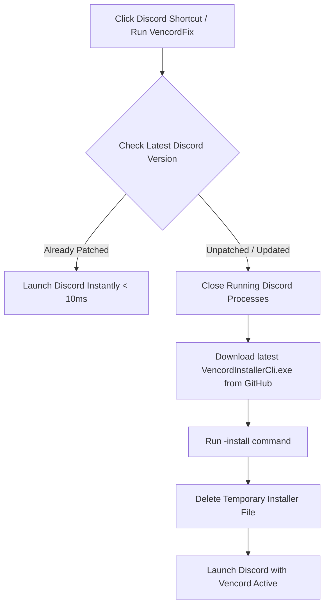

<div align="center">

# ⚡ VencordFix (Windows)

**Automated Discord Patcher, Updater, and Smart Launcher for Vencord on Windows**  
*Never manually reinstall Vencord again! Automatically detects updates, patches Discord silently, and cleans up temporary files.*

[](https://github.com/)
[](LICENSE)
[](https://discord.com)
[](https://vencord.dev)

**English** | [繁體中文](README.zh-TW.md)

</div>

---

## 📑 Table of Contents

- [Problem & Solution](#-problem--solution)
- [Key Features](#-key-features)
- [How It Works](#-how-it-works)
- [Repository Structure](#-repository-structure)
- [Quick Start Guide (Recommended)](#-quick-start-guide-recommended)
- [Command-Line Arguments](#️-command-line-arguments)
- [Antivirus & False Positive Notice](#-antivirus--false-positive-notice)
- [Build from Source](#️-build-from-source)
- [Disclaimer](#-disclaimer)
- [License](#-license)

---

## 💡 Problem & Solution

Whenever Discord updates itself in the background on Windows, its Squirrel updater creates a fresh `app-<version>` directory and overwrites the patched `app.asar`. This breaks Vencord, requiring users to manually download the installer and reinstall it repeatedly.

**VencordFix** solves this pain point completely:
- **Instant Launch When Patched**: Checks the patch state in milliseconds (< 10ms) and immediately launches Discord without internet delays.
- **Auto-Patch When Discord Updates**: When an unpatched version is detected, it automatically downloads the latest official `VencordInstallerCli.exe` from GitHub, safely applies the patch, cleans up the downloaded executable, and launches Discord.
- **Background Update Watcher**: Can run as a silent background watcher or system tray application to patch Discord the instant Discord downloads a new version.

---

## ✨ Key Features

- ⚡ **Lightning Fast Verification**: Instantly inspects Discord's `app-*` version directory and `resources\_app.asar` state.
- 📦 **Official Releases**: Downloads the latest installer directly from the [official Vencord/Installer repository](https://github.com/Vencord/Installer).
- 🧹 **100% Zero-Trace Cleanup**: Guaranteed cleanup via `finally` blocks—downloaded installer files are immediately deleted after execution.
- 🚀 **Full Discord Edition Support**: Automatically recognizes and supports:
  - Discord (Stable)
  - Discord PTB
  - Discord Canary
  - Discord Development
- 🛡️ **Antivirus-Friendly Design**: Uses a dedicated AppData temp folder (`%LocalAppData%\VencordFix\temp\`) instead of the system root `%TEMP%` to avoid heuristic dropper warnings. Includes standard assembly metadata.
- 💎 **Zero External Dependencies**: Ships with a pre-compiled standalone binary `bin\VencordFix.exe` (~300KB with embedded icon) and an open-source PowerShell script.

---

## 🔄 How It Works



---

## 📁 Repository Structure

```text
vencord-fix/
│
├── bin/
│   └── VencordFix.exe                  # Standalone Windows executable (Fast, no setup needed)
│
├── src/                                # C# source code (Compiles with native Windows csc.exe)
│   ├── Program.cs                      # Entry point, CLI argument parsing, and Tray icon
│   ├── DiscordApp.cs                   # Detection, version sorting, and process launch
│   ├── VencordInstaller.cs             # Download, patching, and cleanup logic
│   ├── WatcherService.cs               # FileSystemWatcher for real-time update detection
│   ├── ShortcutHelper.cs               # Desktop shortcut and Windows startup management
│   └── AssemblyInfo.cs                 # Assembly metadata for AV heuristic safety
│
├── scripts/                            # One-click helper scripts
│   ├── Install-Shortcut.bat            # Creates Desktop shortcut for Discord [VencordFix]
│   ├── Install-Startup-Watcher.bat     # Adds background watcher to Windows startup
│   ├── Uninstall-Startup-Watcher.bat   # Removes Windows startup watcher
│   └── Test-Cleanup-Verification.ps1   # Verification test script for temp file cleanup
│
├── VencordFix.ps1                      # Core PowerShell automation script
├── Run.bat                             # Double-clickable runner
├── build.bat / build.ps1               # Compiles C# source into bin\VencordFix.exe
├── LICENSE                             # MIT Open Source License
├── README.md                           # English Documentation (Default)
└── README.zh-TW.md                     # Traditional Chinese Documentation
```

---

## 🚀 Quick Start Guide (Recommended)

### Option 1: Replace Desktop Discord Shortcut (Easiest & Recommended 🌟)

1. Double-click [`scripts\Install-Shortcut.bat`](scripts/Install-Shortcut.bat).
2. A shortcut named **`Discord (VencordFix)`** will be created on your Desktop.
3. **Use this shortcut to launch Discord**:
   - Normally: Opens Discord instantly.
   - After a Discord update: Automatically patches Vencord in the background and opens Discord. You never have to reinstall manually!

---

### Option 2: Run Background Watcher on Startup (Fully Hands-Free)

If you want Discord to be automatically patched the moment it downloads an update in the background:
1. Double-click [`scripts\Install-Startup-Watcher.bat`](scripts/Install-Startup-Watcher.bat).
2. The watcher will silently monitor Discord directories on Windows startup and patch any newly downloaded versions automatically.

> To disable startup monitoring later, simply run [`scripts\Uninstall-Startup-Watcher.bat`](scripts/Uninstall-Startup-Watcher.bat).

---

### Option 3: Manual & Command-Line Usage

- **Direct Launch**: Double-click `Run.bat` or `bin\VencordFix.exe`.
- **Command Line Examples**:
  ```cmd
  # Standard launch (Check, auto-patch if needed, then launch Discord)
  bin\VencordFix.exe

  # Force re-download and re-patch Vencord
  bin\VencordFix.exe --force

  # Run in System Tray mode (Tray icon in bottom right corner)
  bin\VencordFix.exe --tray

  # Patch and install OpenAsar simultaneously
  bin\VencordFix.exe --openasar
  ```

---

## ⚙️ Command-Line Arguments

| Argument | Short | Description |
| :--- | :--- | :--- |
| `-b, --branch <branch>` | `-b` | Discord branch (`auto`, `stable`, `ptb`, `canary`, `dev`). Default: `auto` |
| `-f, --force` | `-f` | Force re-downloading and re-patching Vencord |
| `--no-launch` | | Check and patch only; do not start Discord afterwards |
| `--openasar` | | Install OpenAsar along with Vencord |
| `-w, --watch` | `-w` | Run real-time console watcher mode (Press Ctrl+C to stop) |
| `--tray` | | Run in Windows System Tray background mode |
| `--install-shortcut` | | Create Desktop shortcut |
| `--install-startup` | | Register background watcher in Windows Startup (HKCU Run) |
| `--uninstall-startup` | | Remove Windows Startup entry |
| `-s, --silent` | `-s` | Silent mode (suppress console output) |
| `-h, --help` | `-h` | Display help screen |

---

## 🛡️ Antivirus & False Positive Notice

Because this tool modifies third-party application files (`Discord\resources\app.asar`) and downloads an executable from GitHub, some antivirus engines (such as Kaspersky, Windows Defender, Bitdefender) might trigger heuristic flags (`HEUR:Trojan-Downloader` or `Generic.Hook`).

This project is **100% open-source, safe, and transparent**:
1. **Isolated Temp Path**: Downloads to `%LocalAppData%\VencordFix\temp\` instead of the system root `%TEMP%`.
2. **Proper Assembly Metadata**: Built with full assembly information, product name, and versioning.
3. **Clean Native Build**: Built using Windows built-in `csc.exe` with no packers, obfuscators, or encryptions.

> **Recommendation**: If your antivirus prompts a warning, add the project folder to your antivirus exclusion list, or use the open-source PowerShell script [`VencordFix.ps1`](VencordFix.ps1) directly.

---

## 🛠️ Build from Source

This project compiles using the built-in Microsoft .NET Framework C# compiler (`csc.exe`) found on every Windows machine. **No Visual Studio or .NET SDK installation is required**:

Double-click `build.bat` or run in PowerShell:
```powershell
.\build.ps1
```
The compiled executable will be output to `bin\VencordFix.exe`.

---

## ⚖️ Disclaimer

- This project is an independent community automation tool and is not affiliated with, maintained by, or endorsed by Discord or Vencord.
- Modifying your Discord client may violate Discord's Terms of Service. Use at your own discretion and risk.

---

## 📄 License

This project is licensed under the [MIT License](LICENSE).
