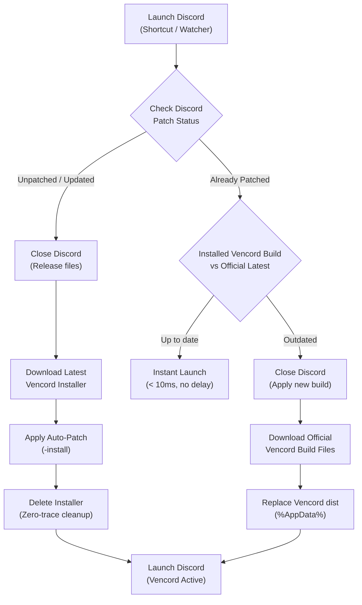

<div align="center">

# VencordFix (Windows)

**Automated Discord Patcher, Updater, and Launcher for Vencord on Windows**  
*Automatically detects updates, patches Discord silently, and cleans up temporary files.*

[](https://github.com/eclipse999/VencordFix/releases)
[](https://github.com/eclipse999/VencordFix)
[](LICENSE)
[](https://discord.com)

**English** | [繁體中文](docs/README.zh-TW.md)

</div>

---

<div align="center">

## ⬇️ [Download VencordFix (Latest Release)](https://github.com/eclipse999/VencordFix/releases/latest)

| Package | Description |
| :--- | :--- |
| **`VencordFix.exe`** | Standalone Portable Executable (Recommended, No install needed) |
| **`VencordFix-Windows.zip`** | Complete Package (Includes standalone executable & helper scripts) |

</div>

---

## Table of Contents

- [Overview](#overview)
- [Features](#features)
- [How It Works](#how-it-works)
- [Repository Structure](#repository-structure)
- [Quick Start Guide](#quick-start-guide)
- [Command-Line Arguments](#command-line-arguments)
- [Why "Click here to restart" No Longer Appears](#why-click-here-to-restart-no-longer-appears)
- [Antivirus and False Positive Notice](#antivirus-and-false-positive-notice)
- [Build from Source](#build-from-source)
- [Disclaimer](#disclaimer)
- [License](#license)

---

## Overview

Whenever Discord updates in the background on Windows, its updater creates a new `app-<version>` directory and replaces the patched `app.asar` with an unpatched version. This breaks Vencord, requiring users to manually download and rerun the installer.

**VencordFix** automates this entire lifecycle:
- **Instant Launch When Patched**: Checks the patch state in under 10ms and immediately launches Discord without internet delays.
- **Auto-Patch After Updates**: When an unpatched version is detected, it automatically downloads the latest official `VencordInstallerCli.exe` from GitHub, applies the patch, cleans up the downloaded file, and launches Discord.
- **No More "Click here to restart"**: Before launching, the installed Vencord build in `%AppData%\Vencord\dist` is compared with the official latest release and synced when outdated, so Vencord never stops halfway to ask for a restart.
- **Background Watcher**: Can optionally run as a background watcher or system tray service to patch Discord immediately when an update folder is created.

---

## Features

- **Minimalist GUI**: Lightweight 3-button setup window to create desktop shortcuts, enable the startup watcher, or toggle pre-launch Vencord syncing in seconds.
- **Fast Verification**: Inspects Discord's version directory and `resources\_app.asar` state directly (< 10ms).
- **Official Releases**: Downloads the latest installer from the [official Vencord repository](https://github.com/Vencord/Installer).
- **Pre-launch Build Sync**: Reads the installed Vencord build hash from `%AppData%\Vencord\dist\patcher.js` (the same method the official installer uses) and downloads the official release assets only when they differ.
- **Clean File Management**: Downloaded installer files are deleted immediately after execution, with retries and leftover purging.
- **Multi-Branch Support**: Supports Discord (Stable), Discord PTB, Discord Canary, and Discord Development.
- **Antivirus Safe**: Uses a dedicated AppData path (`%LocalAppData%\VencordFix\temp\`) instead of `%TEMP%` to avoid heuristic dropper warnings.
- **Zero Dependencies**: Includes a pre-compiled standalone binary `bin\VencordFix.exe` (~75KB) with embedded icons and an open-source PowerShell script.

---

## How It Works


```mermaid
flowchart TD
    A["Launch Discord<br/>(Shortcut / Watcher)"] --> B{"Check Discord<br/>Patch Status"}
    B -->|Unpatched / Updated| D["Close Discord<br/>(Release files)"]
    D --> E["Download Latest<br/>Vencord Installer"]
    E --> F["Apply Auto-Patch<br/>(-install)"]
    F --> G["Delete Installer<br/>(Zero-trace cleanup)"]
    G --> H["Launch Discord<br/>(Vencord Active)"]
    B -->|Already Patched| I{"Installed Vencord Build<br/>vs Official Latest"}
    I -->|Up to date| C["Instant Launch<br/>(&lt; 10ms, no delay)"]
    I -->|Outdated| J["Close Discord<br/>(Apply new build)"]
    J --> K["Download Official<br/>Vencord Build Files"]
    K --> L["Replace Vencord dist<br/>(%AppData%)"]
    L --> H
```

---

## Repository Structure

```text
VencordFix/
│
├── assets/                             # Icons and visual assets
│   └── app.ico                         # Custom VencordFix tool icon
├── bin/                                # Compiled standalone binary (VencordFix.exe)
├── docs/                               # Translations and documentation
│   └── README.zh-TW.md                 # Traditional Chinese documentation
├── scripts/                            # One-click helper scripts
│   ├── Install-Shortcut.bat            # Creates Desktop shortcut
│   ├── Install-Startup-Watcher.bat     # Registers startup watcher
│   └── Uninstall-Startup-Watcher.bat   # Removes startup watcher
├── src/                                # C# source code
│   ├── Program.cs                      # Entry point, CLI parsing, and Tray icon
│   ├── MainForm.cs                     # Minimalist graphical setup interface
│   ├── DiscordApp.cs                   # Detection and process management
│   ├── VencordInstaller.cs             # Download, patch, and cleanup logic
│   ├── VencordBuildSync.cs             # Pre-launch Vencord build comparison and sync
│   ├── FixConfig.cs                    # User settings stored in %LocalAppData%
│   ├── WatcherService.cs               # FileSystemWatcher for update monitoring
│   ├── ShortcutHelper.cs               # Shortcut and startup registry helpers
│   └── AssemblyInfo.cs                 # Assembly metadata
│
├── .gitignore
├── build.bat / build.ps1               # Source build scripts
├── LICENSE                             # MIT License
├── README.md                           # English documentation (Default)
├── Run.bat                             # One-click runner
└── VencordFix.ps1                      # Core PowerShell script
```

---

## Quick Start Guide

### Option 1: Minimalist GUI Setup (Recommended for Non-Technical Users)

1. Double-click **`VencordFix.exe`** (or run `Run.bat`).
2. A clean setup window will appear with three main options:
   - **Click `1. Create Desktop Shortcut`**: Creates a `Discord (VencordFix)` shortcut on your Desktop. From now on, launch Discord from this shortcut—it automatically verifies and patches Vencord before launching.
   - **Click `2. Background Startup Watcher`**: Silently monitors Discord in the background on Windows startup, automatically patching Vencord as soon as Discord updates.
   - **Click `3. Pre-launch Vencord Sync`** (enabled by default): Syncs the latest official Vencord build before Discord starts, so the "VENCORD HAS BEEN UPDATED! Click here to restart" popup never appears.
3. Close the window. Setup is complete!

---

### Option 2: Command-Line and Portable Usage

You can also run `VencordFix.exe` directly via command line:
```cmd
# Open the graphical setup window
bin\VencordFix.exe --gui

# Shortcut mode (silent check & launch Discord)
bin\VencordFix.exe --launch

# Force re-download and re-patch Vencord
bin\VencordFix.exe --force

# Run in System Tray background mode
bin\VencordFix.exe --tray

# Show patch state and Vencord build diagnostics
bin\VencordFix.exe --status
```

---

## Command-Line Arguments

| Argument | Short | Description |
| :--- | :--- | :--- |
| `-b, --branch <branch>` | `-b` | Discord branch (`auto`, `stable`, `ptb`, `canary`, `dev`). Default: `auto` |
| `-f, --force` | `-f` | Force re-downloading and re-patching Vencord |
| `--no-launch` | | Check and patch only; do not start Discord afterwards |
| `--sync-builds` | | Sync the latest official Vencord build before launching (default: on) |
| `--no-sync-builds` | | Disable the pre-launch build sync and let Vencord update itself |
| `--check-interval <min>` | | Cache TTL for the release check; `0` = always check (default: `0`) |
| `--status` | | Print patch state and Vencord version diagnostics, then exit |
| `--openasar` | | Install OpenAsar along with Vencord |
| `-w, --watch` | `-w` | Run real-time console watcher mode (Ctrl+C to stop) |
| `--tray` | | Run in Windows System Tray background mode |
| `--install-shortcut` | | Create Desktop shortcut |
| `--install-startup` | | Register background watcher in Windows Startup (HKCU Run) |
| `--uninstall-startup` | | Remove Windows Startup entry |
| `-s, --silent` | `-s` | Silent mode (suppress console output) |
| `-h, --help` | `-h` | Display help screen |

---

## Why "Click here to restart" No Longer Appears

Vencord ships with its own auto-updater. When it runs, it only checks GitHub *after* Discord has already started:

1. `VencordFix` sees that `app.asar` (a ~218-byte injector) is patched and launches Discord immediately.
2. The old Vencord build inside `%AppData%\Vencord\dist` is loaded into memory.
3. That old build notices a newer official release, downloads the new files over itself, and asks for a restart—because the code in memory is still the old one.

Because `VencordFix` now performs the same comparison *before* launching (using the `// Vencord <hash>` banner in `patcher.js`, exactly like the official installer), Discord is always started with the newest build loaded, so the popup never has a reason to appear. If Discord is already running when an update is detected, it is restarted automatically as part of the same click.

Files involved:

| Path | Purpose |
| :--- | :--- |
| `%AppData%\Vencord\dist\*.js` | The actual Vencord code that Discord loads |
| `%LocalAppData%\VencordFix\config.json` | `{"syncBuilds":true,"checkIntervalMinutes":0}` |
| `%LocalAppData%\VencordFix\cache\vencord-release.json` | Last fetched release metadata |

> Run `VencordFix.exe --status` to see the installed and latest build hashes, the detected injector target, and the current sync settings.

> Prefer to stay on an older Vencord build? Turn option **3** off (or pass `--no-sync-builds`); VencordFix will then leave `%AppData%\Vencord\dist` completely untouched.

---

## Antivirus and False Positive Notice

Because this tool modifies client files (`Discord\resources\app.asar`) and downloads an executable from GitHub, some antivirus software (such as Kaspersky, Windows Defender, or Bitdefender) may trigger heuristic detection (`HEUR:Trojan-Downloader` or `Generic.Hook`).

This project is open-source and applies the following safeguards:
1. **Isolated Temp Path**: Downloads to `%LocalAppData%\VencordFix\temp\` instead of the system root `%TEMP%`.
2. **Standard Metadata**: Built with complete assembly attributes, product name, and version numbers.
3. **Clean Native Build**: Built using Windows built-in `csc.exe` with no packers or obfuscators.

> If your antivirus displays a warning, add the project folder to your exclusion list, or run the open-source PowerShell script [`VencordFix.ps1`](VencordFix.ps1) directly.

---

## Build from Source

This project compiles using the built-in Microsoft .NET Framework C# compiler (`csc.exe`) available on all modern Windows installations. No Visual Studio or .NET SDK installation is required.

Run `build.bat` or execute in PowerShell:
```powershell
.\build.ps1
```
The compiled executable will be placed in `bin\VencordFix.exe`.

---

## Disclaimer

- This project is an independent community tool and is not affiliated with, maintained by, or endorsed by Discord or Vencord.
- Modifying your Discord client may violate Discord's Terms of Service. Use at your own discretion.

---

## License

This project is licensed under the [MIT License](LICENSE).
