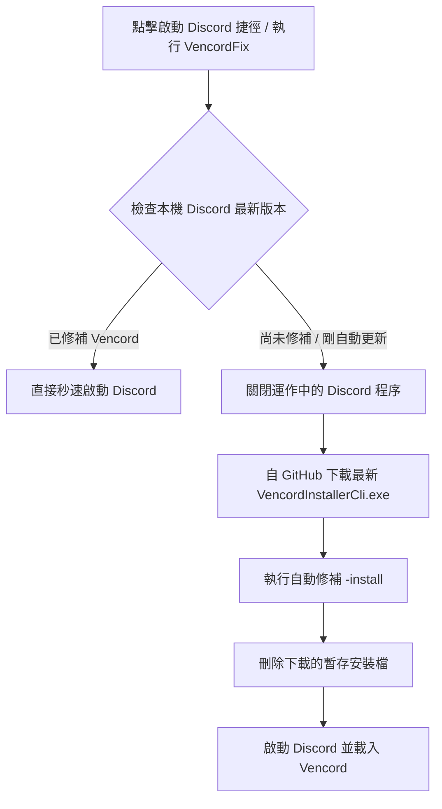

<div align="center">

# ⚡ VencordFix (Windows)

**專為 Windows 使用者設計的 Discord Vencord 自動修補與智慧啟動器**  
*再也不用手動重新安裝 Vencord！Discord 更新後自動無痕修補並啟動。*

[](https://github.com/)
[](../LICENSE)
[](https://discord.com)
[](https://vencord.dev)

[English](../README.md) | **繁體中文**

</div>

---

## 📑 目錄 (Table of Contents)

- [背景痛點與解決方案](#-背景痛點與解決方案)
- [核心功能特色](#-核心功能特色)
- [運作流程圖](#-運作流程圖)
- [專案結構](#-專案結構)
- [快速開始指南 (推薦使用方式)](#-快速開始指南-推薦使用方式)
- [完整命令列參數](#️-完整命令列參數)
- [防毒軟體安全與誤報說明](#-防毒軟體安全與誤報說明)
- [自行編譯 (Build from Source)](#️-自行編譯-build-from-source)
- [免責聲明 (Disclaimer)](#-免責聲明-disclaimer)
- [開源授權 (License)](#-開源授權-license)

---

## 💡 背景痛點與解決方案

每當 Discord 自動在後台發布更新時，原本被 Vencord 修補的 `app.asar` 會被 Discord 官方乾淨版本覆蓋，導致 Vencord 插件失效，使用者往往必須手動去官網下載安裝程式並重新點擊安裝，非常繁瑣。

**VencordFix** 徹底解決了這個問題：
- **平日啟動**：毫秒級直接啟動 Discord（耗時 < 10ms），無網路延遲。
- **更新後啟動**：自動偵測到未修補狀態，自動自 GitHub 官方下載最新 `VencordInstallerCli.exe`、完成修補、刪除暫存檔並開啟 Discord。
- **背景守護**：亦可作為開機背景守護程式，在 Discord 更新寫入硬碟的瞬間即時自動修補。

---

## ✨ 核心功能特色

- ⚡ **毫秒級智慧判斷**：精準讀取 `app-*` 版本目錄與 `resources\_app.asar` 結構，修補狀態下一秒直接拉起 Discord。
- 📦 **官方來源自動下載**：自動自 [Vencord 官方發行庫](https://github.com/Vencord/Installer) 獲取最新修補檔。
- 🧹 **100% 無痕暫存清理**：修補完成或中途報錯時，`finally` 機制保證立即刪除下載的安裝檔。
- 🚀 **完整支援各 Discord 版本**：自動支援 `Discord (Stable)`、`Discord PTB`、`Discord Canary`、`Discord Development`。
- 🛡️ **防毒啟發式安全設計**：使用專屬隔離暫存目錄 `%LocalAppData%\VencordFix\temp\`，降低 Dropper 誤判。
- 💎 **零外部依賴**：內建提供已編譯完成的獨立執行檔 `VencordFix.exe`（約 300KB，內嵌圖示），以及開源 PowerShell 腳本。

---

## 🔄 運作流程圖



---

## 📁 專案結構

```text
vencord-fix/
│
├── bin/
│   └── VencordFix.exe                  # 原生獨立執行檔 (免安裝、極速啟動)
│
├── docs/                               # 說明文件庫
│   └── README.zh-TW.md                 # 繁體中文說明手冊
│
├── src/                                # C# 原生程式碼 (使用 Windows 內建 csc 編譯)
│   ├── Program.cs                      # 程式進入點、參數解析與托盤介面
│   ├── DiscordApp.cs                   # Discord 安裝偵測、版本排序與啟動
│   ├── VencordInstaller.cs             # 下載、修補、清理暫存邏輯
│   ├── WatcherService.cs               # FileSystemWatcher 即時背景更新監聽
│   ├── ShortcutHelper.cs               # 桌面捷徑與開機啟動管理
│   └── AssemblyInfo.cs                 # 組件版本與中繼資料 (防誤判優化)
│
├── scripts/                            # 輔助一鍵工具
│   ├── Install-Shortcut.bat            # 一鍵在桌面建立 Discord [VencordFix] 捷徑
│   ├── Install-Startup-Watcher.bat     # 一鍵將背景監控加入開機自動啟動
│   ├── Uninstall-Startup-Watcher.bat   # 一鍵移除開機自動監控設定
│   └── Test-Cleanup-Verification.ps1   # 暫存檔自動無痕清理驗證腳本
│
├── VencordFix.ps1                      # 核心 PowerShell 自動化腳本
├── Run.bat                             # 一鍵雙擊執行修補與啟動
├── build.bat / build.ps1               # 一鍵編譯 C# 為 exe
├── LICENSE                             # MIT 開源授權條款
└── README.md                           # 英文主說明手冊 (預設首頁)
```

---

## 🚀 快速開始指南 (推薦使用方式)

### 方式一：取代桌面 Discord 捷徑（最推薦、最簡單 🌟）

1. 雙擊執行 [`scripts\Install-Shortcut.bat`](../scripts/Install-Shortcut.bat)。
2. 您的桌面上會產生一個 **`Discord (VencordFix)`** 捷徑。
3. **日常直接使用此捷徑開啟 Discord**：
   - 平日：直接秒速開啟 Discord。
   - Discord 更新後：點擊會自動在背景修補並開啟 Discord，您完全不需要做任何手動重新安裝！

---

### 方式二：設定開機後台自動監控（完全無感）

如果您希望 Discord 在背景默默更新時就被自動修補：
1. 雙擊執行 [`scripts\Install-Startup-Watcher.bat`](../scripts/Install-Startup-Watcher.bat)。
2. 程式會在 Windows 開機時於背景靜默監控 Discord 目錄，一旦 Discord 下載新版本，程式會即時在背景完成 Vencord 修補。

> 若日後想取消開機啟動，只需執行 [`scripts\Uninstall-Startup-Watcher.bat`](../scripts/Uninstall-Startup-Watcher.bat)。

---

### 方式三：手動與進階執行

- **雙擊執行**：直接點擊 `Run.bat` 或 `bin\VencordFix.exe`。
- **命令列範例**：
  ```cmd
  # 一般啟動 (自動檢查修補並啟動 Discord)
  bin\VencordFix.exe

  # 強制重新修補 Vencord (即使目前已修補)
  bin\VencordFix.exe --force

  # 啟動系統托盤守護模式 (右下角常駐圖示)
  bin\VencordFix.exe --tray

  # 修補並一併安裝 OpenAsar
  bin\VencordFix.exe --openasar
  ```

---

## ⚙️ 完整命令列參數

| 參數 | 簡寫 | 說明 |
| :--- | :--- | :--- |
| `-b, --branch <branch>` | `-b` | 指定 Discord 分支（`auto`、`stable`、`ptb`、`canary`、`dev`），預設為 `auto` |
| `-f, --force` | `-f` | 強制重新自 GitHub 下載並修補 Vencord |
| `--no-launch` | | 僅執行檢查與修補，完成後不自動啟動 Discord |
| `--openasar` | | 修補時一併安裝 OpenAsar |
| `-w, --watch` | `-w` | 啟動 Console 背景監控模式 (按 Ctrl+C 結束) |
| `--tray` | | 啟動 Windows 系統托盤背景守護模式 |
| `--install-shortcut` | | 在桌面建立快捷方式 |
| `--install-startup` | | 將背景監控寫入 Windows 開機自動啟動 (HKCU Run) |
| `--uninstall-startup` | | 移除開機自動啟動項目 |
| `-s, --silent` | `-s` | 靜默模式（隱藏終端機輸出） |
| `-h, --help` | `-h` | 顯示參數說明畫面 |

---

## 🛡️ 防毒軟體安全與誤報說明

由於本工具涉及「從網路下載安裝檔」與「修補第三方軟體檔案 (`app.asar`)」之行為，部分防毒軟體（如 Kaspersky、Windows Defender）可能會觸發啟發式分析（Heuristic）警報。

本專案完全開源透明，無任何惡意代碼，並已採取以下安全防護：
1. **專屬目錄隔離**：下載檔案存放於 `%LocalAppData%\VencordFix\temp\`，絕不污染系統 `%TEMP%`。
2. **完整中繼資料**：包含完整的組件名稱、版本號與簽名中繼資訊。
3. **無加殼純淨編譯**：使用 Windows 原生 `csc.exe` 編譯，無任何混淆加殼。

> **提示**：若防毒軟體跳出提示，建議將專案目錄加入防毒軟體排除名單（白名單），或直接使用純文字開源的 [`VencordFix.ps1`](../VencordFix.ps1) 運行。

---

## 🛠️ 自行編譯 (Build from Source)

本專案使用 Windows 系統內建的 Microsoft .NET Framework C# 編譯器（`csc.exe`），您**無需安裝任何 Visual Studio 或 .NET SDK** 即可編譯：

雙擊執行 `build.bat` 或在 PowerShell 執行：
```powershell
.\build.ps1
```
編譯後的可執行檔將產生於 `bin\VencordFix.exe`。

---

## ⚖️ 免責聲明 (Disclaimer)

- 本工具非 Discord 或 Vencord 官方出品，僅為社群開發之自動化輔助工具。
- 修改 Discord 客戶端可能違反 Discord 服務條款 (ToS)，使用者須自行評估並承擔相關風險。

---

## 📄 開源授權 (License)

本專案採用 [MIT License](../LICENSE) 開源授權。
