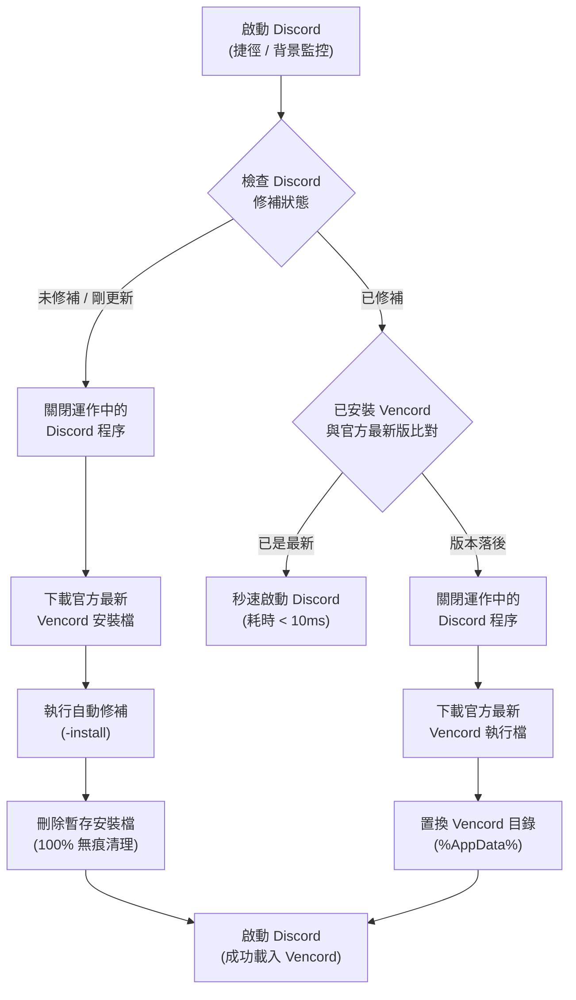

<div align="center">

# VencordFix (Windows)

**專為 Windows 使用者設計的 Discord Vencord 自動修補與智慧啟動器**  
*Discord 更新後自動無痕修補並啟動，無需手動重新安裝。*

[](https://github.com/eclipse999/VencordFix/releases)
[](https://github.com/eclipse999/VencordFix)
[](../LICENSE)
[](https://discord.com)

[English](../README.md) | **繁體中文**

</div>

---

<div align="center">

## ⬇️ [點此下載 VencordFix 最新版本 (Latest Release)](https://github.com/eclipse999/VencordFix/releases/latest)

| 發布項目 | 說明 |
| :--- | :--- |
| **`VencordFix.exe`** | 單檔免安裝獨立版（推薦，雙擊即可開啟極簡設定） |
| **`VencordFix-Windows.zip`** | 包含獨立執行檔與輔助腳本之完整組合包 |

</div>

---

## 目錄 (Table of Contents)

- [背景與解決方案](#背景與解決方案)
- [核心功能特色](#核心功能特色)
- [運作流程圖](#運作流程圖)
- [專案結構](#專案結構)
- [快速開始指南](#快速開始指南)
- [完整命令列參數](#完整命令列參數)
- [為什麼不再出現「點此重新啟動」提示](#為什麼不再出現點此重新啟動提示)
- [防毒軟體安全與誤報說明](#防毒軟體安全與誤報說明)
- [自行編譯 (Build from Source)](#自行編譯-build-from-source)
- [免責聲明](#免責聲明)
- [開源授權](#開源授權)

---

## 背景與解決方案

每當 Discord 自動在後台發布更新時，原本被 Vencord 修補的 `app.asar` 會被 Discord 官方乾淨版本覆蓋，導致 Vencord 插件失效，使用者往往必須手動下載安裝程式並重新點擊安裝。

**VencordFix** 自動化了整個維護流程：
- **平日啟動**：毫秒級直接啟動 Discord（耗時 < 10ms），無網路延遲。
- **更新後啟動**：自動偵測到未修補狀態，自 GitHub 官方下載最新 `VencordInstallerCli.exe` 完成修補，刪除暫存檔並開啟 Discord。
- **不再跳出「點此重新啟動」**：啟動前會比對 `%AppData%\Vencord\dist` 內已安裝的 Vencord 版本與官方最新版，若落後就直接同步到最新，啟動後不會再被 Vencord 要求重啟。
- **背景守護**：亦可作為開機背景守護程式，在 Discord 更新檔案寫入硬碟時即時自動修補。

---

## 核心功能特色

- **極簡圖形介面**：提供 3 個核心按鈕的設定面板，3 秒內完成桌面捷徑建立、開機背景監控或啟動前自動同步設定。
- **快速驗證**：直接檢查 Discord 版本目錄與 `resources\_app.asar` 結構（耗時 < 10ms）。
- **官方來源**：自 [Vencord 官方發行庫](https://github.com/Vencord/Installer) 自動下載最新修補檔。
- **啟動前版本同步**：讀取 `%AppData%\Vencord\dist\patcher.js` 首行的 `// Vencord <雜湊>`（與官方 Installer 相同判定方式），僅在版本落後時下載官方發行檔案。
- **無痕清理**：修補完成後立即刪除下載的安裝檔，並具備重試與殘留檔清除機制。
- **多版本支援**：支援 Discord (Stable)、Discord PTB、Discord Canary 與 Discord Development。
- **防毒友善設計**：使用專屬隔離目錄 `%LocalAppData%\VencordFix\temp\`，避免觸發 Dropper 誤判。
- **零外部依賴**：內建提供已編譯完成的獨立執行檔 `VencordFix.exe`（約 75KB，內嵌專屬圖示）與開源 PowerShell 腳本。

---

## 運作流程圖


```mermaid
flowchart TD
    A["啟動 Discord<br/>(捷徑 / 背景監控)"] --> B{"檢查 Discord<br/>修補狀態"}
    B -->|未修補 / 剛更新| D["關閉運作中的<br/>Discord 程序"]
    D --> E["下載官方最新<br/>Vencord 安裝檔"]
    E --> F["執行自動修補<br/>(-install)"]
    F --> G["刪除暫存安裝檔<br/>(100% 無痕清理)"]
    G --> H["啟動 Discord<br/>(成功載入 Vencord)"]
    B -->|已修補| I{"已安裝 Vencord<br/>與官方最新版比對"}
    I -->|已是最新| C["秒速啟動 Discord<br/>(耗時 &lt; 10ms)"]
    I -->|版本落後| J["關閉運作中的<br/>Discord 程序"]
    J --> K["下載官方最新<br/>Vencord 執行檔"]
    K --> L["置換 Vencord 目錄<br/>(%AppData%)"]
    L --> H
```

---

## 專案結構

```text
VencordFix/
│
├── assets/                             # 圖示與視覺資源庫
│   └── app.ico                         # VencordFix 專屬工具圖示
├── bin/                                # 獨立編譯執行檔 (VencordFix.exe)
├── docs/                               # 多語系文檔庫
│   └── README.zh-TW.md                 # 繁體中文說明手冊
├── scripts/                            # 輔助設定腳本
│   ├── Install-Shortcut.bat            # 建立桌面捷徑
│   ├── Install-Startup-Watcher.bat     # 設定開機背景監控
│   └── Uninstall-Startup-Watcher.bat   # 移除開機背景監控
├── src/                                # C# 原生原始碼
│   ├── Program.cs                      # 程式進入點、參數解析與托盤介面
│   ├── MainForm.cs                     # 極簡圖形設定視窗
│   ├── DiscordApp.cs                   # Discord 安裝偵測與啟動
│   ├── VencordInstaller.cs             # 下載、修補與清理邏輯
│   ├── VencordBuildSync.cs             # 啟動前 Vencord 版本比對與同步
│   ├── FixConfig.cs                    # 使用者設定 (%LocalAppData%)
│   ├── WatcherService.cs               # FileSystemWatcher 即時監控
│   ├── ShortcutHelper.cs               # 桌面捷徑與開機啟動管理
│   └── AssemblyInfo.cs                 # 組件中繼資料
│
├── .gitignore
├── build.bat / build.ps1               # 一鍵編譯工具
├── LICENSE                             # MIT 授權條款
├── README.md                           # 英文主說明手冊 (預設首頁)
├── Run.bat                             # 雙擊一鍵修補並啟動
└── VencordFix.ps1                      # 核心 PowerShell 腳本
```

---

## 快速開始指南

### 方式一：極簡圖形介面設定（推薦小白用戶）

1. 直接雙擊執行 **`VencordFix.exe`**（或 `Run.bat`）。
2. 視窗會跳出極簡設定介面，提供三個核心選項：
   - **點擊「1. 在桌面建立啟動捷徑」**：在桌面產生 `Discord (VencordFix)` 捷徑。未來直接由此捷徑開啟 Discord，啟動前會自動在背景檢查並修補 Vencord。
   - **點擊「2. 開機背景監控」**：設定 Windows 開機後台靜默守護，當 Discord 自動下載更新時即時在背景修補。
   - **點擊「3. 啟動前同步 Vencord 最新版」**（預設開啟）：啟動前先同步官方最新版，讓 Discord 一開啟就是最新 Vencord，不會再跳出「點此重新啟動」。
3. 設定完成後即可關閉視窗，輕鬆搞定！

---

### 方式二：命令列與進階執行

您也可以透過命令列直接調用 `VencordFix.exe`：
```cmd
# 開啟圖形設定視窗
bin\VencordFix.exe --gui

# 捷徑模式 (靜默檢查並啟動 Discord)
bin\VencordFix.exe --launch

# 強制重新修補 Vencord
bin\VencordFix.exe --force

# 啟動系統托盤守護模式
bin\VencordFix.exe --tray

# 顯示修補狀態與 Vencord 版本診斷
bin\VencordFix.exe --status
```

---

## 完整命令列參數

| 參數 | 簡寫 | 說明 |
| :--- | :--- | :--- |
| `-b, --branch <branch>` | `-b` | 指定 Discord 分支（`auto`、`stable`、`ptb`、`canary`、`dev`），預設為 `auto` |
| `-f, --force` | `-f` | 強制重新自 GitHub 下載並修補 Vencord |
| `--no-launch` | | 僅執行檢查與修補，完成後不自動啟動 Discord |
| `--sync-builds` | | 啟動前同步官方最新 Vencord 執行檔（預設即開啟） |
| `--no-sync-builds` | | 關閉啟動前同步，改由 Vencord 自行更新 |
| `--check-interval <分鐘>` | | 版本檢查快取時間，`0` 表示每次都檢查（預設 `0`） |
| `--status` | | 顯示修補狀態與 Vencord 版本診斷後結束 |
| `--openasar` | | 修補時一併安裝 OpenAsar |
| `-w, --watch` | `-w` | 啟動 Console 背景監控模式 (按 Ctrl+C 結束) |
| `--tray` | | 啟動 Windows 系統托盤背景守護模式 |
| `--install-shortcut` | | 在桌面建立快捷方式 |
| `--install-startup` | | 將背景監控寫入 Windows 開機自動啟動 (HKCU Run) |
| `--uninstall-startup` | | 移除開機自動啟動項目 |
| `-s, --silent` | `-s` | 靜默模式（隱藏終端機輸出） |
| `-h, --help` | `-h` | 顯示參數說明畫面 |

---

## 為什麼不再出現「點此重新啟動」提示

Vencord 本身內建自動更新，但它只在 Discord **啟動之後**才會檢查 GitHub：

1. `VencordFix` 看到 `app.asar`（僅約 218 bytes 的注入器）已修補，於是直接啟動 Discord。
2. 記憶體中載入的是 `%AppData%\Vencord\dist` 內的「舊版」Vencord。
3. 這個舊版才發現官方出了新版，於是下載新檔案覆蓋自己，並要求重新啟動（因為記憶體中仍是舊程式碼）。

現在 `VencordFix` 會在啟動**之前**先做同樣的比對（讀取 `patcher.js` 首行的 `// Vencord <雜湊>`，與官方 Installer 完全相同的判定方式），因此 Discord 每次開啟時載入的都已經是最新版，彈出提示的理由就不存在了。若偵測到新版時 Discord 正在執行，也會在同一次點擊中自動關閉並重新開啟套用。

相關檔案：

| 路徑 | 用途 |
| :--- | :--- |
| `%AppData%\Vencord\dist\*.js` | Discord 實際載入的 Vencord 程式碼 |
| `%LocalAppData%\VencordFix\config.json` | `{"syncBuilds":true,"checkIntervalMinutes":0}` |
| `%LocalAppData%\VencordFix\cache\vencord-release.json` | 最近一次取得的官方發行資訊 |

> 執行 `VencordFix.exe --status` 可查看目前已安裝版本、官方最新版本、注入器目標路徑與同步設定。

> 想固定在舊版 Vencord？只要關閉選項 **3**（或加上 `--no-sync-builds`），VencordFix 就不會去動 `%AppData%\Vencord\dist`。

---

## 防毒軟體安全與誤報說明

由於本工具涉及「從網路下載安裝檔」與「修補第三方軟體檔案 (`app.asar`)」之行為，部分防毒軟體（如 Kaspersky、Windows Defender）可能會觸發啟發式分析（Heuristic）警報。

本專案完全開源透明，並已採取以下安全防護：
1. **專屬目錄隔離**：下載檔案存放於 `%LocalAppData%\VencordFix\temp\`，絕不污染系統 `%TEMP%`。
2. **完整中繼資料**：包含完整的組件名稱、版本號與簽名中繼資訊。
3. **無加殼純淨編譯**：使用 Windows 原生 `csc.exe` 編譯，無任何混淆加殼。

> 若防毒軟體跳出提示，建議將專案目錄加入防毒軟體排除名單，或直接使用純文字開源的 [`VencordFix.ps1`](../VencordFix.ps1) 運行。

---

## 自行編譯 (Build from Source)

本專案使用 Windows 系統內建的 Microsoft .NET Framework C# 編譯器（`csc.exe`），無需安裝任何 Visual Studio 或 .NET SDK 即可編譯：

雙擊執行 `build.bat` 或在 PowerShell 執行：
```powershell
.\build.ps1
```
編譯後的可執行檔將產生於 `bin\VencordFix.exe`。

---

## 免責聲明

- 本工具非 Discord 或 Vencord 官方出品，僅為社群開發之自動化輔助工具。
- 修改 Discord 客戶端可能違反 Discord 服務條款 (ToS)，使用者須自行評估並承擔相關風險。

---

## 開源授權

本專案採用 [MIT License](../LICENSE) 開源授權。
